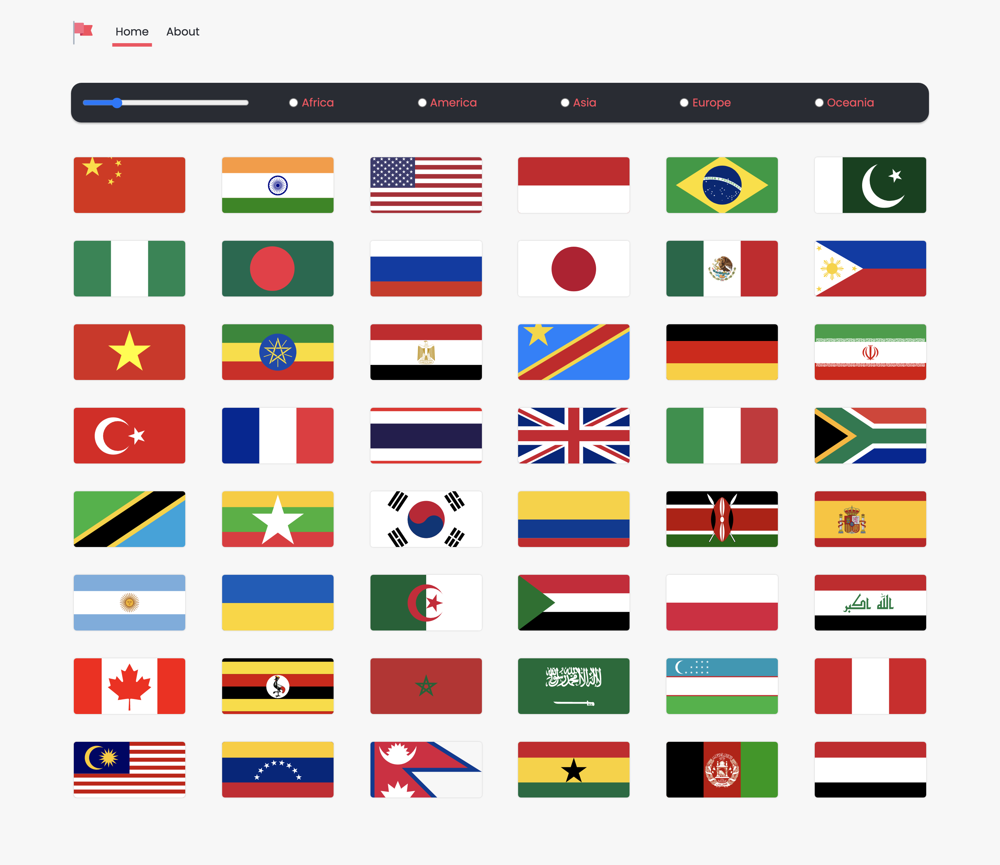

# Countries app

Application permettant de récupérer et d'afficher (via un appel API) une liste de pays avec diverses informations. 
Possibilité d'afficher un nombre défini de pays (via un input range) ainsi que de les classer par continents.
Projet développé avec React et mis en page avec SCSS 

## 🚀 Installation

1. git clone ou télécharger le projet
2. à la racine du projet, lancer **npm start** 

## 💫 Demo

Vidéo de démonstration du site disponible [ici](https://drive.google.com/file/d/1CgASOopJozOfaHEMDn0A0qFuaH1kZ6Lc)
